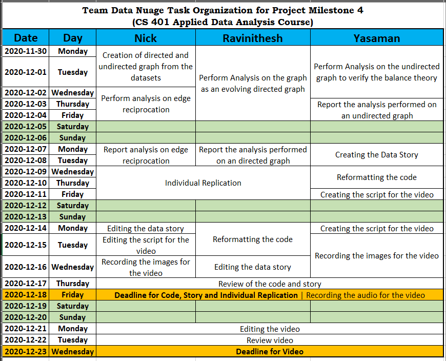

# Behaviour of edge signs in economic and non-living entities networks

## Abstract

The analysis performed in this [work](https://cs.stanford.edu/people/jure/pubs/triads-chi10.pdf) enabled the authors to evaluate social psychological theories of balance and status in social networks. This work allows us to better understand and predict the signs of relationships in social networks. To take this analysis one step further, we would like to observe how well these social theories hold up when the network context has changed. Moreover, we would also like to perceive the similarities and differences in analyzing the signs of relationships between entities created by people instead of the people themselves. For these two cases, we will be using a bitcoin dataset to provide a network in a financial setting (economic context) and a Reddit dataset that presents a graph of subreddits created by users. Our analysis would include observing and also presenting statistics about the number of balanced and unbalanced triads in the data and thereby interpreting the validity of balance and status theory and corroborate or contradict the claims of the authors made in the original paper.

## Research Questions

In this extension, we want to verify and discuss the generalization of the balance and status theory on other types of networks. Specifically, we want to examine whether the proposed theories can be extended to economic networks i.e. will the relations between people (users) still follow the balance and status theory even when there is a direct cash transaction involved? Secondly, will the theories of balance and status propagate from the individual human relations to the nonliving entities that are created and controlled by living entities?

## Proposed datasets

For this extension, we are going to use the following two datasets.

In order to answer the first question we use [soc-sign-bitcoinalpha.csv.gz](http://snap.stanford.edu/data/soc-sign-bitcoin-alpha.html) dataset and use [soc-redditHyperlinks-body.tsv](http://snap.stanford.edu/data/soc-RedditHyperlinks.html) for the second question.

## Methods

### Undirected Analysis (to evaluate 'balance' theory)

1. Observe the counts of 4 possible signed triads.
2. Observe the frequency of triad occurrence with a random distribution of signs in the network.
3. Contrast between the original triad frequency and with random distribution.

### Directed Analysis (to evaluate 'status' theory predictions)

1. Observe the frequency of Contextualized links (clink): It's a triple formed when node A and node B have an edge to or from another node X before A and B form an edge between each other.
2. Compute the generative baseline and surprise, receptive baseline, and surprise for each type of clink.
3. Using the above-computed metrics, check the consistency with Balance and Status theory.

### Perform analysis on edge reciprocation

1. Observe the number of reciprocations for each type of edge that is the first connection being positive or negative and reciprocal connection being negative or positive
2. Calculate the probability of reciprocation for each type

## Proposed Timeline and Organization within the team

The below image shows the timeline and organization of tasks between the team members.

#### Notes

1. As the analysis of the undirected graph is also part of individual replication, `Yasaman` does not work on it when others are working on extending their replication.
2. We plan to have a stand-up meeting once every three days to check on each other and help each other with anything blocking our progress.
